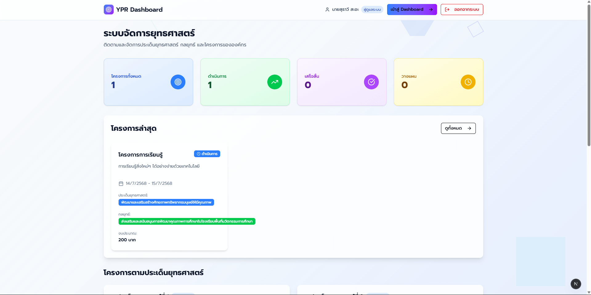
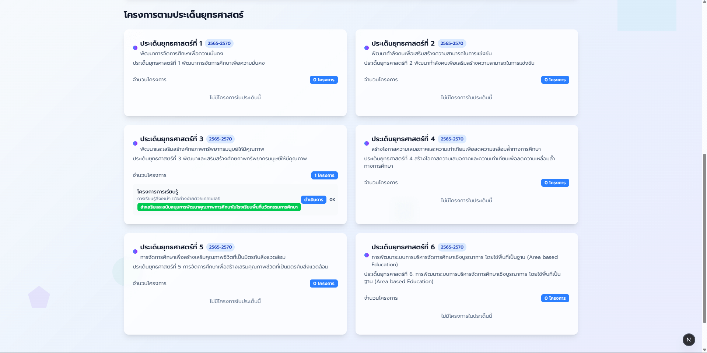
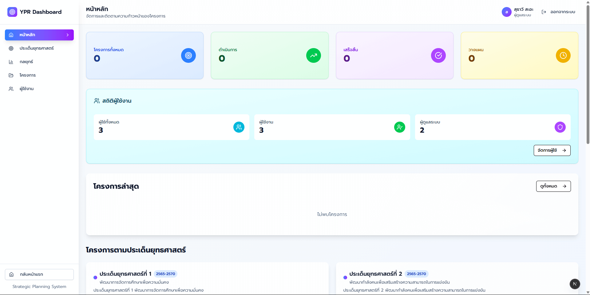
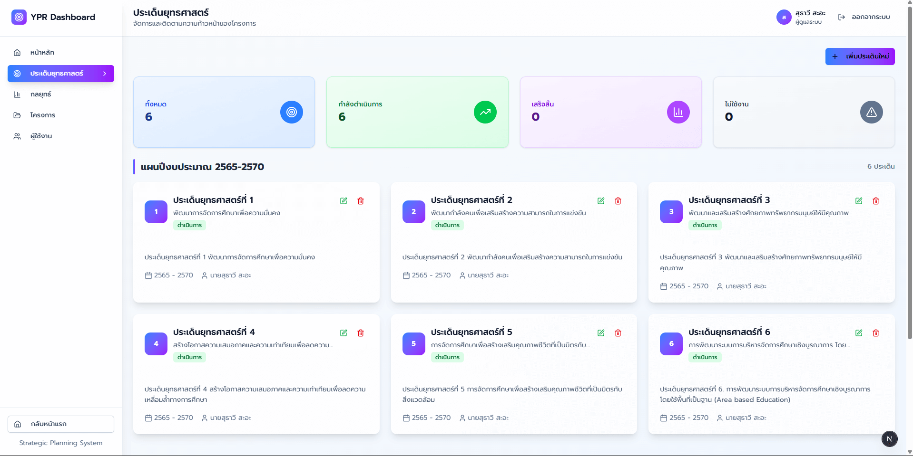
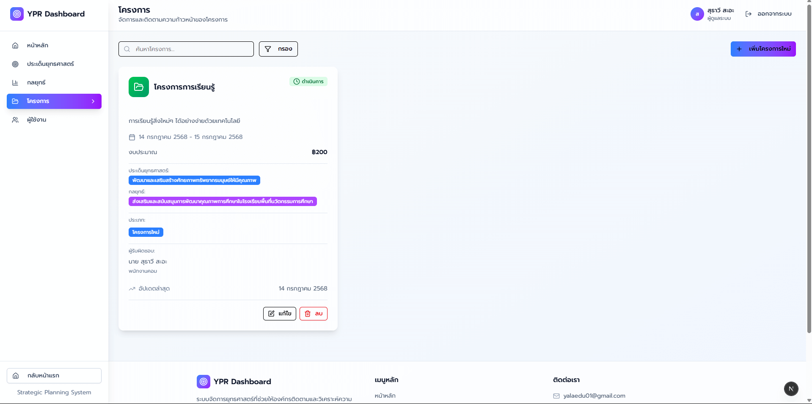
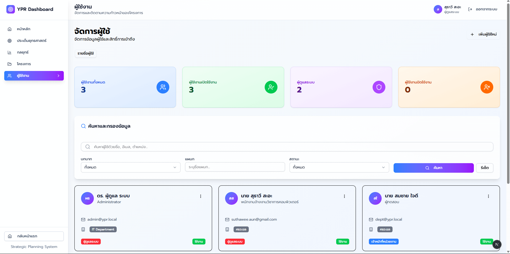

# ระบบจัดการด้านการศึกษาจังหวัดยะลา

A modern, responsive dashboard for strategic planning and project management built with Next.js, TailwindCSS, and Shadcn UI.

## Screenshots

### Homepage & Welcome

*Welcome page with modern design and navigation*


*Homepage layout showing system introduction*

### Dashboard & Management


*Main dashboard showing overview of strategic planning system*


*Strategic issues management interface with comprehensive data view*


*Strategies tracking and management dashboard*


*Project management interface with filtering and CRUD operations*


*User management system with role-based access control*

> **Note**: These screenshots represent the current state of the application. The interface may continue to evolve as new features are added.

## Features

- **Strategic Issues Management** - จัดการประเด็นยุทธศาสตร์ขององค์กร
- **Strategy Tracking** - ติดตามกลยุทธ์และแผนงาน
- **Project Management** - จัดการโครงการและความก้าวหน้า
- **Advanced Project Filtering & Search** - ระบบกรองและค้นหาโครงการขั้นสูง
  - ค้นหาตามชื่อโครงการ, กิจกรรมหลัก, ผู้รับผิดชอบ
  - กรองตามงบประมาณ (ช่วงราคา)
  - กรองตามประเภทโครงการ (ใหม่/ต่อเนื่อง)
  - กรองตามสถานะ (วางแผน/ดำเนินการ/เสร็จสิ้น/ยกเลิก)
  - กรองตามช่วงวันที่ (วันเริ่ม-วันสิ้นสุด)
  - กรองตามอำเภอที่ดำเนินการ
  - กรองตามประเด็นยุทธศาสตร์และกลยุทธ์
- **User Management** - จัดการผู้ใช้งานในระบบ
- **Authentication System** - ระบบเข้าสู่ระบบและจัดการสิทธิ์
- **Responsive Design** - ใช้งานได้ทุกอุปกรณ์
- **Modern UI** - ออกแบบด้วย Clean และ Minimal aesthetic
- **Loading States** - UX loading states สำหรับการนำทางและการโหลดข้อมูล
- **Error Handling** - ระบบจัดการข้อผิดพลาดและแสดงข้อความเตือน
- **Real-time Filter Statistics** - แสดงสถิติตามข้อมูลที่กรองแล้ว

## Technology Stack

- **Frontend**: Next.js 15.3.5 (React 19.0.0)
- **Styling**: TailwindCSS 4.1.11
- **UI Components**: Shadcn UI + Radix UI
- **Icons**: Lucide React 0.525.0
- **Backend**: Node.js + Express
- **Database**: MySQL2
- **Authentication**: Custom JWT implementation
- **HTTP Client**: Axios
- **State Management**: React Hooks + Context API
- **Font**: Geist Sans
- **Language**: TypeScript

## Installation

1. Clone the repository:
```bash
git clone aun-suthawee/ypr_app
cd ypr_app
```

2. Install dependencies:
```bash
npm install
```

3. Run the development server:
```bash
npm run dev
```

4. Open [http://localhost:3000](http://localhost:3000) in your browser.

## Available Scripts

- `npm run dev` - Start development server
- `npm run build` - Build for production
- `npm start` - Start production server
- `npm run lint` - Run ESLint

## Project Structure

```
ypr_app/
├── backend/                     # Backend API server
│   ├── src/
│   │   ├── controllers/         # API controllers
│   │   ├── models/              # Database models
│   │   ├── routes/              # API routes
│   │   ├── middleware/          # Auth & validation middleware
│   │   └── config/              # Database configuration
│   ├── migrations/              # Database migrations
│   └── server.js                # Backend entry point
├── src/
│   ├── app/
│   │   ├── dashboard/
│   │   │   ├── page.tsx              # Dashboard homepage
│   │   │   ├── strategic-issues/
│   │   │   │   └── page.tsx         # Strategic issues page
│   │   │   ├── strategies/
│   │   │   │   └── page.tsx         # Strategies page
│   │   │   ├── projects/
│   │   │   │   └── page.tsx         # Projects page
│   │   │   └── users/
│   │   │       └── page.tsx         # Users page
│   │   ├── login/
│   │   │   └── page.tsx             # Login page
│   │   ├── layout.tsx               # Root layout
│   │   ├── page.tsx                 # Homepage (redirects to dashboard)
│   │   ├── middleware.ts            # Next.js middleware for auth
│   │   └── globals.css              # Global styles
│   ├── components/
│   │   ├── ui/                      # Shadcn UI components
│   │   ├── auth/                    # Authentication components
│   │   ├── projects/                # Project-specific components
│   │   ├── users/                   # User management components
│   │   ├── dashboard-layout.tsx     # Dashboard layout wrapper
│   │   ├── dashboard-index.tsx      # Dashboard homepage content
│   │   ├── project-filter.tsx       # Advanced project filtering component
│   │   ├── custom-badges.tsx        # Custom badge components
│   │   ├── loading-skeleton.tsx     # Loading skeleton components
│   │   ├── redirect-loading.tsx     # Navigation loading overlay
│   │   └── footer.tsx               # Footer component
│   ├── contexts/
│   │   └── AuthContext.tsx          # Authentication context
│   ├── hooks/                       # Custom React hooks
│   │   ├── useProjects.ts
│   │   ├── useStrategicIssues.ts
│   │   ├── useStrategies.ts
│   │   └── useUsers.ts
│   ├── services/                    # API service layers
│   │   ├── projectService.ts
│   │   ├── userService.ts
│   │   └── publicService.ts
│   ├── types/                       # TypeScript type definitions
│   │   ├── project.ts
│   │   ├── strategicIssues.ts
│   │   ├── strategies.ts
│   │   └── user.ts
│   └── lib/
│       ├── utils.ts                 # Utility functions
│       ├── auth.ts                  # Authentication utilities
│       ├── mock-data.ts             # Mock data for development
│       └── notifications.ts         # Notification utilities
└── public/                          # Static assets
```

## Design System

### Colors
- **Primary**: Blue gradient (#3B82F6 to #8B5CF6)
- **Background**: Soft muted blue/white (#FAFBFC)
- **Text**: Slate colors for hierarchy
- **Success**: Green (#10B981)
- **Warning**: Yellow (#F59E0B)
- **Error**: Red (#EF4444)

### Typography
- **Primary Font**: Geist Sans
- **Weights**: Regular (400), Medium (500), Semibold (600), Bold (700)

### Components
- **Rounded corners**: 0.5rem default
- **Shadows**: Soft shadows with blur effects
- **Hover states**: Smooth transitions (300ms)
- **Glass morphism**: Backdrop blur effects
- **Loading States**: Minimal transparent overlays

## Architecture

### Frontend
- **Next.js 15** with App Router
- **Server-Side Rendering** for better SEO
- **Client-Side Navigation** with loading states
- **Responsive Design** with mobile-first approach
- **TypeScript** for type safety

### Backend
- **Express.js** REST API
- **MySQL** database with connection pooling
- **JWT Authentication** with middleware protection
- **CORS** enabled for frontend communication

### State Management
- **React Context** for authentication state
- **Custom Hooks** for data fetching and management
- **Local State** with useState and useEffect

## Authentication & Authorization

### User Roles
- **Admin**: Full access to all features
- **User**: Limited access based on ownership

### Protected Routes
- Dashboard pages require authentication
- Project editing restricted to owners/admins
- User management for admins only

## Data Structure

### Users (ผู้ใช้งาน)
```typescript
interface User {
  id: string;
  email: string;
  role: 'admin' | 'department';
  title_prefix?: string;
  first_name: string;
  last_name: string;
  position?: string;
  department?: string;
  is_active: boolean;
  created_at: string;
  permissions?: UserPermissions;
}

interface UserPermissions {
  strategic_issues: string[];
  strategies: string[];
  projects: string[];
  users: string[];
}
```

### Strategic Issues (ประเด็นยุทธศาสตร์)
```typescript
interface StrategicIssue {
  id: string;
  title: string;
  description: string;
  start_year: number;
  end_year: number;
  start_year_display?: number; // Buddhist Era year for display
  end_year_display?: number; // Buddhist Era year for display
  order: number; // ลำดับของประเด็นยุทธศาสตร์
  status: 'active' | 'inactive' | 'completed';
  created_by: string;
  created_at: string;
  updated_at: string;
  creator: {
    name: string;
    first_name: string;
    last_name: string;
    title_prefix: string;
  };
}
```

### Strategies (กลยุทธ์)
```typescript
interface Strategy {
  id: string;
  strategic_issue_id: string;
  name: string;
  description: string;
  order: number; // ลำดับของกลยุทธ์
  created_by: string;
  created_at: string;
  updated_at: string;
  creator: {
    name: string;
    first_name: string;
    last_name: string;
    title_prefix: string;
  };
  strategic_issue: {
    id: string;
    title: string;
    order?: number;
    start_year?: number;
    end_year?: number;
  };
}
```

### Projects (โครงการ)
```typescript
interface Project {
  id: string;
  name: string;
  key_activities: string;
  budget: number;
  expected_results: string;
  project_type: 'new' | 'continuous';
  start_date: string;
  end_date: string;
  responsible_title_prefix: string;
  responsible_first_name: string;
  responsible_last_name: string;
  responsible_position: string;
  responsible_phone: string;
  responsible_email: string;
  activity_location: string;
  districts: string[];
  province: string;
  strategic_issues: string[];
  strategies: string[];
  document_links: DocumentLink[];
  status: 'planning' | 'active' | 'completed' | 'cancelled';
  created_by: string;
  created_at: string;
  updated_at: string;
  creator: {
    name: string;
    first_name: string;
    last_name: string;
    title_prefix: string;
  };
  // Additional populated fields from relationships
  strategic_issues_details?: Array<{
    id: string;
    title: string;
    description?: string;
  }>;
  strategies_details?: Array<{
    id: string;
    name: string;
    description?: string;
    strategic_issue_title?: string;
  }>;
}

interface DocumentLink {
  name: string;
  url: string;
  type?: string;
}
```

## Development

### Backend Setup
1. Navigate to backend directory:
```bash
cd backend
npm install
```

2. Configure database connection in `config/database.js`

3. Run database migrations:
```bash
node migrations/runMigrations.js
```

4. Start backend server:
```bash
npm start
# or for development
node server.js
```

### Frontend Development
1. Install dependencies:
```bash
npm install
```

2. Start development server:
```bash
npm run dev
```

### Adding New Components
1. Create component in `src/components/`
2. Use Shadcn UI components when possible:
```bash
npx shadcn@latest add [component-name]
```

3. Follow established patterns:
   - Use TypeScript interfaces
   - Implement proper error handling
   - Add loading states
   - Follow responsive design principles

### Styling Guidelines
- Use TailwindCSS classes
- Follow the established color palette
- Maintain responsive design principles
- Use consistent spacing (4, 6, 8, 12 units)
- Implement glass morphism for modern UI

### API Integration
- Services in `src/services/` handle API communication
- Custom hooks in `src/hooks/` manage data fetching
- Error handling with try-catch and user feedback
- Loading states for better UX

### Project Filtering System
The advanced filtering system supports multiple criteria:

#### Filter Types
- **Text Search**: ค้นหาใน name, key_activities, responsible person
- **Budget Range**: กรองตามช่วงงบประมาณ (ต่ำสุด-สูงสุด)
- **Project Type**: โครงการใหม่ หรือ โครงการต่อเนื่อง
- **Status**: วางแผน, ดำเนินการ, เสร็จสิ้น, ยกเลิก
- **Date Range**: ช่วงวันที่เริ่มและสิ้นสุดโครงการ
- **Districts**: กรองตามอำเภอที่ดำเนินการ
- **Strategic Issues**: ประเด็นยุทธศาสตร์ที่เกี่ยวข้อง
- **Strategies**: กลยุทธ์ที่เกี่ยวข้อง

#### Filter Features
- **Expandable Interface**: ซ่อน/แสดงตัวกรองขั้นสูง
- **Multi-select Support**: เลือกหลายค่าสำหรับ districts, strategic issues, strategies
- **Real-time Statistics**: อัปเดตสถิติตามผลการกรอง
- **Filter Summary**: แสดงสรุปตัวกรองที่ใช้งาน
- **Clear All Filters**: ล้างตัวกรองทั้งหมดในครั้งเดียว

#### Implementation
```typescript
interface ProjectFilters {
  search: string;
  minBudget: string;
  maxBudget: string;
  projectType: string;
  startDate: string;
  endDate: string;
  status: string;
  districts: string[];
  strategicIssueIds: string[];
  strategyIds: string[];
}
```

## Database

### MySQL Tables
- `users` - User accounts and profiles
- `strategic_issues` - Strategic planning issues
- `strategies` - Strategic approaches
- `projects` - Project management data
- `project_strategic_issues` - Many-to-many relationships
- `project_strategies` - Many-to-many relationships

### Migration System
- Located in `backend/migrations/`
- Run with `node migrations/runMigrations.js`
- Automated table creation and data seeding

## Responsive Design

- **Mobile (< 768px)**: 
  - Full-width layout with collapsible sidebar
  - Stacked cards and simplified navigation
  - Touch-optimized buttons and interactions
- **Tablet (768px - 1024px)**: 
  - Balanced layout with side navigation
  - Grid layouts with appropriate breakpoints
- **Desktop (> 1024px)**: 
  - Full sidebar with main content area
  - Multi-column layouts for optimal space usage

## Current Status

### Completed Features ✅
- Authentication system with JWT
- Dashboard layout and navigation
- Strategic Issues management
- Strategies management  
- Projects management (basic CRUD)
- **Advanced Project Filtering & Search System**
  - Multi-criteria filtering (budget, type, status, dates, districts)
  - Strategic issues and strategies filtering
  - Real-time search with instant results
  - Expandable filter interface
  - Filter summary and statistics
- User management
- Responsive design
- Loading states and error handling
- Role-based access control

### In Progress 🚧
- Project form component (temporarily disabled)
- Enhanced project detail views
- Data export functionality

### Known Issues 🐛
- Project form component disabled due to build issues
- Some prerender errors during static export (resolved)

## Future Enhancements

- [ ] Advanced project analytics and reporting
- [ ] Real-time collaboration features
- [ ] **Enhanced filtering features:**
  - [ ] Save and load custom filter presets
  - [ ] Export filtered data to Excel/CSV
  - [ ] Advanced date range picker with presets
  - [ ] Geographic mapping integration
- [ ] Bulk operations for data management
- [ ] Email notifications and alerts
- [ ] Multi-language support (TH/EN)
- [ ] Dark mode support
- [ ] Advanced user permissions
- [ ] Data import/export (Excel, CSV)
- [ ] Project timeline visualization
- [ ] Dashboard customization
- [ ] Mobile app development

## Contributing

1. Fork the repository
2. Create a feature branch (`git checkout -b feature/amazing-feature`)
3. Make your changes following the coding standards
4. Test thoroughly (both frontend and backend)
5. Update documentation if needed
6. Commit your changes (`git commit -m 'Add some amazing feature'`)
7. Push to the branch (`git push origin feature/amazing-feature`)
8. Submit a pull request

### Code Standards
- Follow TypeScript best practices
- Use meaningful component and variable names
- Add proper error handling
- Include loading states for async operations
- Write responsive CSS with mobile-first approach
- Document complex logic with comments

## Deployment

### Frontend (Next.js)
```bash
npm run build
npm start
```

### Backend (Express)
```bash
cd backend
node server.js
```

### Environment Variables
Create `.env.local` for frontend and `.env` for backend with appropriate configuration.

## License

This project is licensed under the MIT License - see the LICENSE file for details.

## Support

For support and questions:
- Create an issue in the repository
- Review the documentation
- Check existing issues for similar problems

---

Built with ❤️ using Next.js, React, and modern web technologies

**Version**: 0.1.0  
**Last Updated**: July 2025
